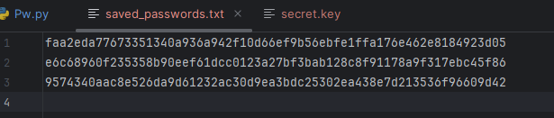

# Password Strength Checker

A Python-based GUI application that checks the strength of passwords, verifies if they are common, and estimates the time it would take to brute-force crack them. The application also allows users to generate strong random passwords, check if a password hash exists in a historic passwords file, and save password hashes for future reference.

## Features

- **Password Strength Checker**: Evaluates password strength based on length, presence of uppercase letters, lowercase letters, digits, symbols, and common password lists.
- **Common Password Checker**: Checks if the entered password is among the 10,000 most common passwords by fetching the list from a GitHub repository.
- **Password Generation**: Generates random, strong passwords that include lowercase, uppercase, digits, and symbols.
- **Brute Force Estimation**: Estimates how long it would take to crack the password via slow and simple brute-force attacks.
- **Saved Passwords**: Allows saving password hashes to a file and checking if a password hash has already been used.
- **Simple UI**: Simple, aesthetic interface built using Tkinter,

## Installation

1. Clone the repository:

   ```bash
   git clone https://github.com/yourusername/password-strength-checker.git
   
## Screenshots

### 1. Password Strength Check


### 2. Randomly Generated Password with Less Then 8 Characters


### 3. Generated Secure Password 


### 4. Saved hashes from previous used passwords

